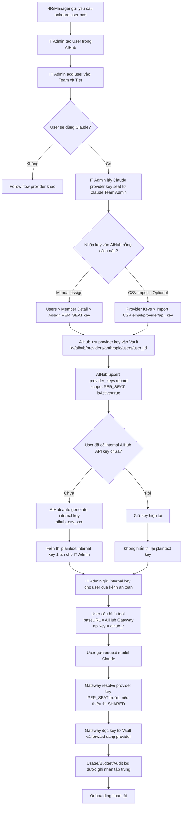

# AIHub — On-Boarding New Member Workflow

**Phiên bản**: 1.0  
**Cập nhật**: 2026-04-21
**Trạng thái**: REVIEWED

---

```mermaid
flowchart TD
    A[HR/Manager gửi yêu cầu onboard user mới] --> B[IT Admin tạo User trong AIHub]
    B --> C[IT Admin add user vào Team và Tier]
    C --> D{User sẽ dùng Claude?}

    D -->|Không| Z[Follow flow provider khác]
    D -->|Có| E[IT Admin lấy Claude provider key seat từ Claude Team Admin]

    E --> F{Nhập key vào AIHub bằng cách nào?}
    F -->|Manual assign| G[Users > Member Detail > Assign PER_SEAT key]
    F -->|CSV import - Optional| H[Provider Keys > Import CSV email/provider/api_key]

    G --> I[AIHub lưu provider key vào Vault\nkv/aihub/providers/anthropic/users/user_id]
    H --> I

    I --> J[AIHub upsert provider_keys record\nscope=PER_SEAT, isActive=true]
    J --> K{User đã có internal AIHub API key chưa?}

    K -->|Chưa| L[AIHub auto-generate internal key\naihub_env_xxx]
    K -->|Rồi| M[Giữ key hiện tại]

    L --> N[Hiển thị plaintext internal key 1 lần cho IT Admin]
    M --> O[Không hiển thị lại plaintext key]
    N --> P[IT Admin gửi internal key cho user qua kênh an toàn]
    O --> P

    P --> Q[User cấu hình tool:\nbaseURL = AIHub Gateway\napiKey = aihub_*]
    Q --> R[User gửi request model Claude]
    R --> S[Gateway resolve provider key:\nPER_SEAT trước, nếu thiếu thì SHARED]
    S --> T[Gateway đọc key từ Vault và forward sang provider]
    T --> U[Usage/Budget/Audit log được ghi nhận tập trung]
    U --> V[Onboarding hoàn tất]
```