# AIHub — Kiến trúc hệ thống

**Phiên bản**: 1.0  
**Cập nhật**: 2026-04-18  
**Trạng thái**: Phase 2 (MVP)

---

## Mục lục

1. [Tổng quan kiến trúc](#1-tổng-quan-kiến-trúc)
2. [Luồng xử lý chi tiết](#2-luồng-xử-lý-chi-tiết)
3. [Từng thành phần và nhiệm vụ](#3-từng-thành-phần-và-nhiệm-vụ)
4. [Bảo mật theo chiều sâu](#4-bảo-mật-theo-chiều-sâu)
5. [Rủi ro, thách thức và giải pháp](#5-rủi-ro-thách-thức-và-giải-pháp)
6. [Lộ trình cải thiện](#6-lộ-trình-cải-thiện)

---

## 1. Tổng quan kiến trúc

### 1.1 Ba lớp hệ thống

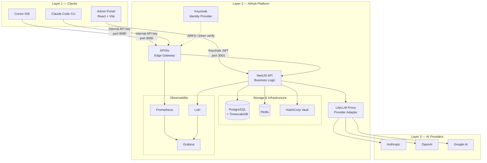

### 1.2 Nguyên tắc thiết kế cốt lõi

| Nguyên tắc | Hiện thực hóa |
|-----------|---------------|
| **Single entry point** | Mọi AI request đều qua APISix — không có đường tắt |
| **Zero-trust với provider key** | Provider key chỉ tồn tại trong Vault, nhân viên không bao giờ thấy |
| **Defense in depth** | 4 lớp bảo vệ: Gateway → Auth → Policy → Rate Limit |
| **Hash-only key storage** | SHA-256 hash được lưu, không bao giờ lưu plaintext |
| **Metadata-only logging** | Prompt/response content không được log theo mặc định |
| **Cloud-portability từ ngày 1** | Docker containers, env vars, không hardcode IP |

---

## 2. Luồng xử lý chi tiết

### 2.1 Luồng AI request (Cursor / CLI)

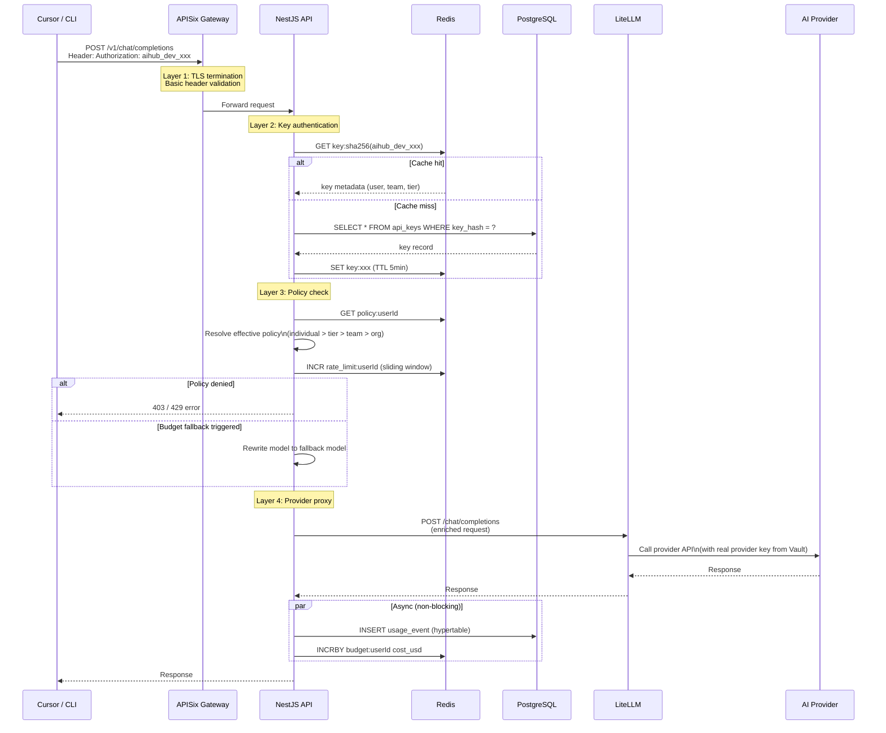

### 2.2 Luồng đăng nhập Admin Portal

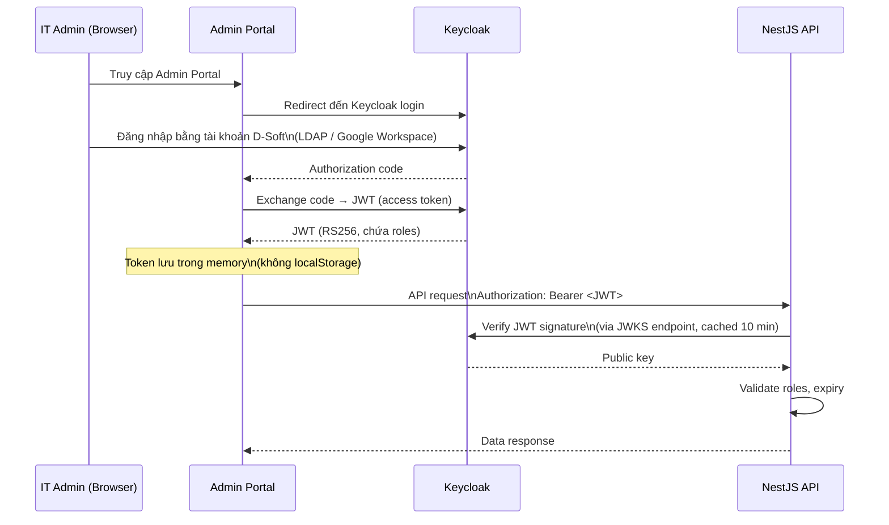

---

## 3. Từng thành phần và nhiệm vụ

### 3.1 Keycloak — Identity Provider

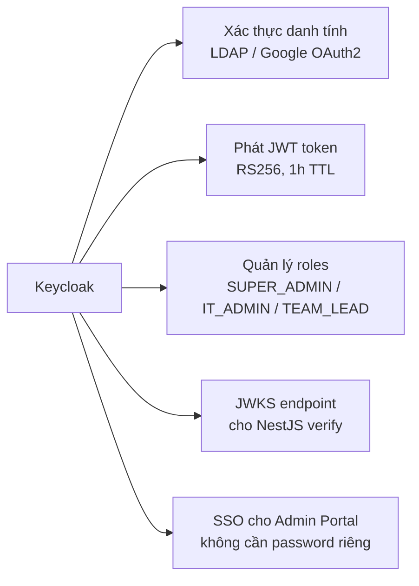

**Nhiệm vụ chính:**
- Tích hợp với directory service của D-Soft (LDAP / Google Workspace)
- Nhân viên đăng nhập một lần, dùng tất cả tool nội bộ (SSO)
- JWT chứa user ID, email, roles — NestJS không cần query DB để lấy thông tin này

**Không làm:** Keycloak không xác thực internal API key. API key (cho Cursor/CLI) đi qua một guard riêng trong NestJS dùng SHA-256 lookup.

---

### 3.2 APISix — Edge Gateway

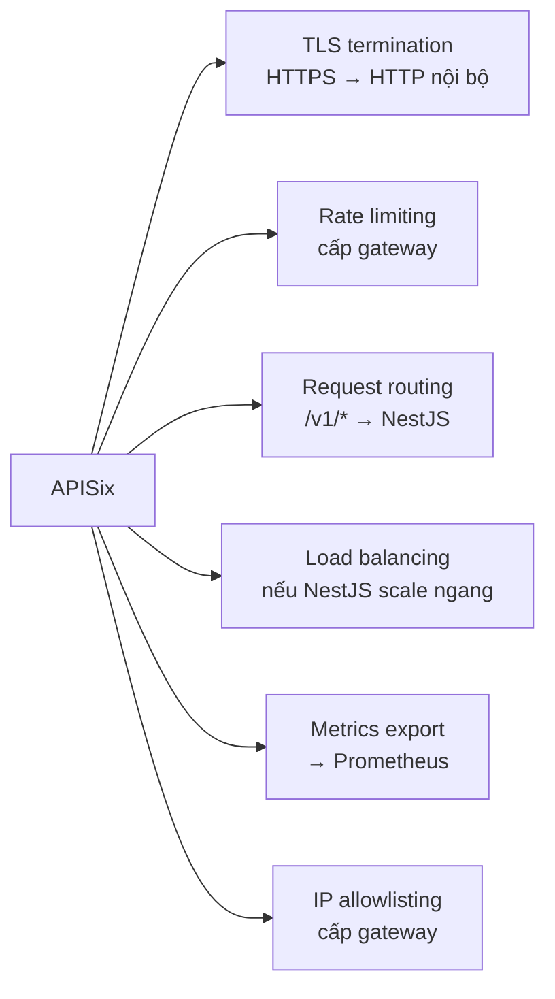

**Nhiệm vụ chính:**
- Điểm vào duy nhất của toàn bộ traffic AI (port 9080)
- Bảo vệ NestJS khỏi các request không hợp lệ ở cấp network
- etcd cluster làm backend config store cho APISix

**Không làm:** APISix không hiểu business logic (policy, budget). Những logic này nằm ở NestJS.

---

### 3.3 NestJS API — Business Logic Core

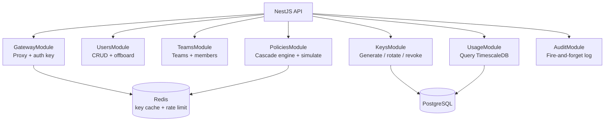

**Nhiệm vụ chính:**
- Validate internal API key bằng SHA-256 lookup (Redis cache → PostgreSQL fallback)
- Resolve effective policy theo cascade: individual > tier > team > org-default
- Proxy request sang LiteLLM sau khi policy pass
- Ghi usage event vào TimescaleDB (bất đồng bộ, không block response)
- Audit log toàn bộ thao tác quản trị

---

### 3.4 LiteLLM Proxy — Provider Adapter

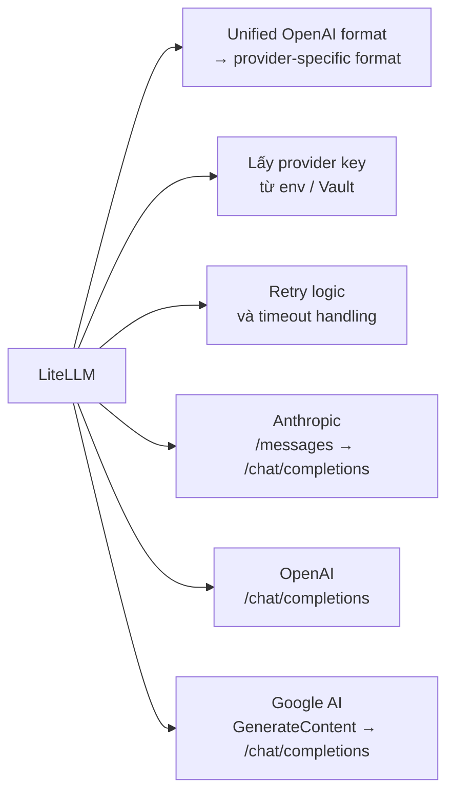

**Nhiệm vụ chính:**
- Nhận request format OpenAI từ NestJS
- Translate sang format native của từng provider
- Trả về response format OpenAI chuẩn (nhân viên không biết đang dùng provider nào)

**Không làm:** LiteLLM không làm auth, không làm policy. Đây chỉ là translation layer.

---

### 3.5 PostgreSQL + TimescaleDB — Primary Database

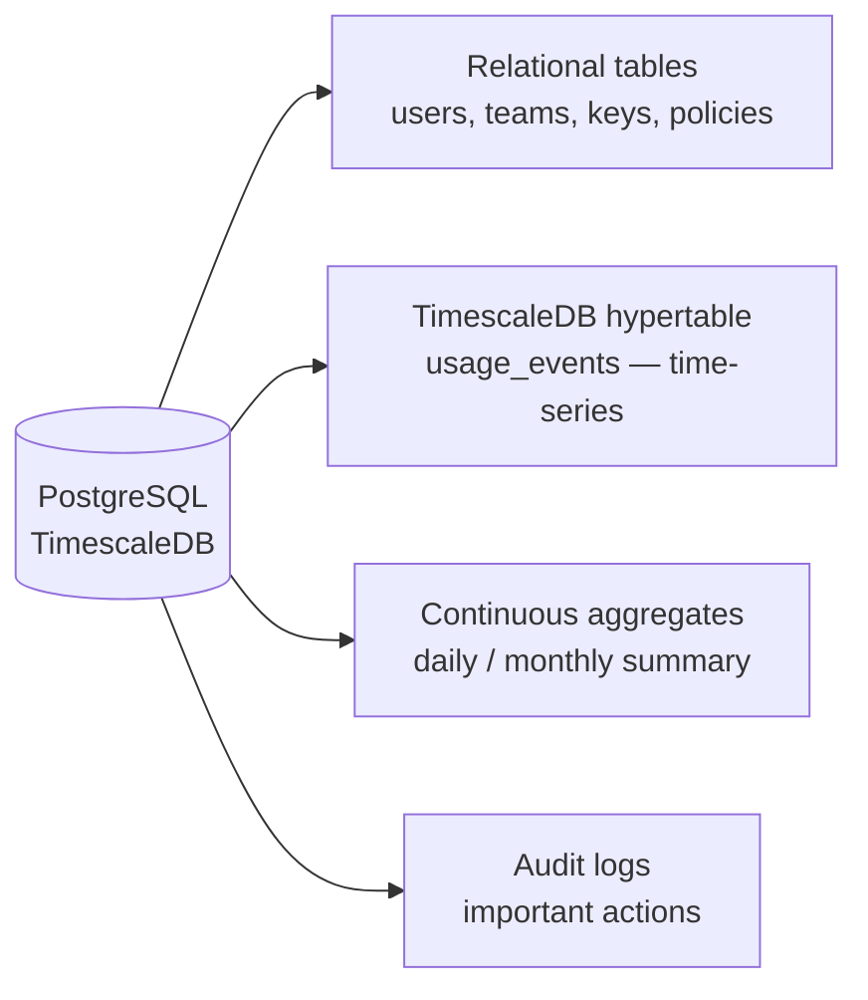

**Phân tầng dữ liệu:**

| Table | Loại | Mục đích |
|-------|------|----------|
| `users`, `teams`, `api_keys`, `policies` | Relational | CRUD bình thường qua Prisma ORM |
| `usage_events` | TimescaleDB hypertable | Insert nhanh, query time-series hiệu quả |
| `audit_logs` | Relational | Immutable history — không update, không delete |

---

### 3.6 Redis — Cache & Counters

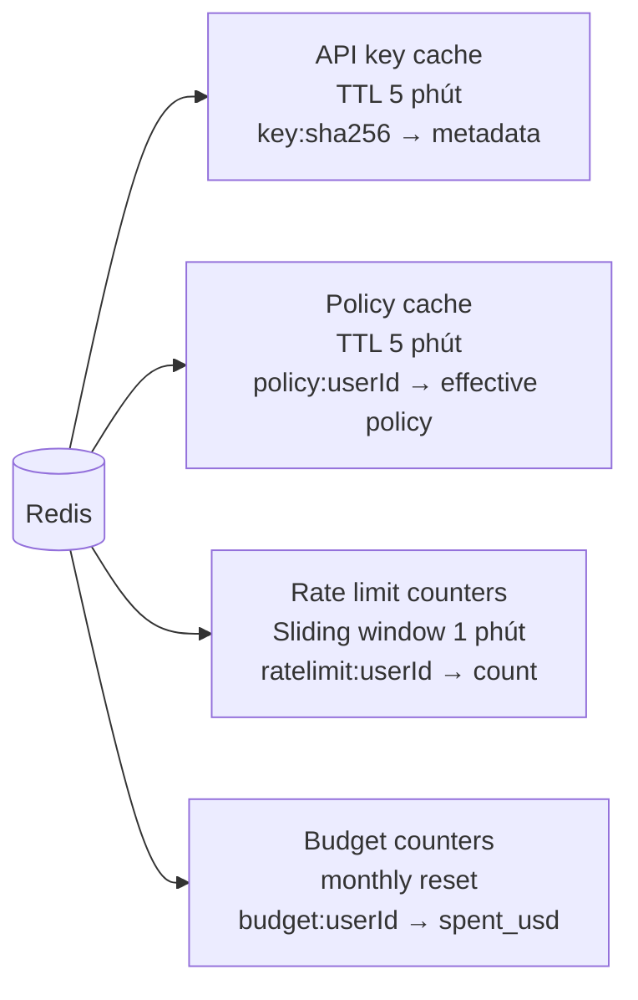

**Tại sao Redis thay vì PostgreSQL cho rate limit?**
- Rate limit cần atomic INCR với TTL — PostgreSQL không hỗ trợ natively
- Mỗi AI request cần lookup key trong < 5ms — query DB quá chậm
- Redis INCR là operation atomic, tránh race condition khi concurrent requests

---

### 3.7 HashiCorp Vault — Secret Management

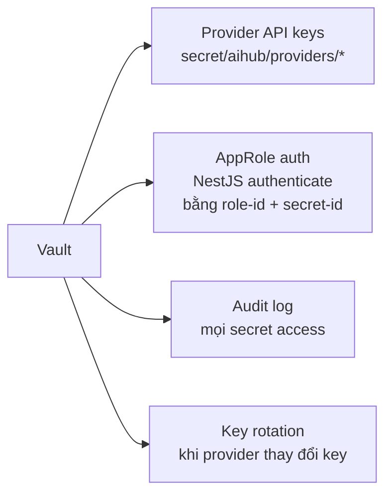

**Luồng NestJS đọc provider key:**
1. Startup: NestJS authenticate với Vault bằng AppRole credentials
2. Nhận Vault token (TTL 1h)
3. Đọc provider key từ `secret/aihub/providers/anthropic`
4. Cache trong memory (không ghi ra disk, không log)
5. Sau 1h: refresh Vault token tự động

---

### 3.8 Prometheus + Grafana + Loki — Observability

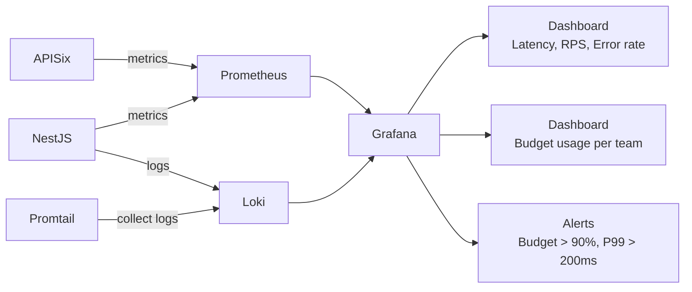

---

## 4. Bảo mật theo chiều sâu

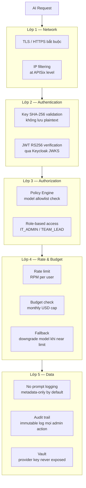

---

## 5. Rủi ro, thách thức và giải pháp

### 5.1 🔴 Rủi ro cao — Quản lý key tập trung bị tấn công

**Mô tả:** Vì AIHub tập trung toàn bộ key và routing, nếu hệ thống bị compromise, attacker có thể truy cập tất cả AI resource của toàn công ty — thay vì chỉ một team như trước.

**Hệ thống đã làm:**

| Giải pháp | Chi tiết |
|-----------|----------|
| SHA-256 hash-only | DB bị dump không dùng được key |
| HashiCorp Vault | Provider key tách biệt hoàn toàn khỏi app DB |
| AppRole auth cho Vault | NestJS chỉ có quyền đọc, không ghi, không list |
| Immutable audit log | Phát hiện unauthorized access sau sự cố |
| Key prefix để triage | `aihub_dev_` vs `aihub_prod_` — dễ revoke theo env |

**Giải pháp tương lai (Phase 4+):**
- Hardware Security Module (HSM) cho encryption key của Vault
- Anomaly detection: alert khi key được dùng từ IP lạ hoặc ngoài giờ làm việc
- Key expiry tự động theo policy (ví dụ: max 90 ngày)
- IP restriction per key (xem `docs/user-manual/02-it-admin-guide.md §10`)

---

### 5.2 🔴 Rủi ro cao — Gateway là single point of failure

**Mô tả:** Nếu APISix hoặc NestJS down, toàn bộ nhân viên mất khả năng dùng AI — không có fallback path.

**Hệ thống đã làm:**

| Giải pháp | Chi tiết |
|-----------|----------|
| Health check endpoint | `GET /health` — monitor liên tục |
| Docker restart policy | `restart: unless-stopped` |
| Prometheus alerts | Alert khi service down > 1 phút |
| Grafana dashboard | Visibility real-time |

**Giải pháp tương lai (Phase 3–4):**

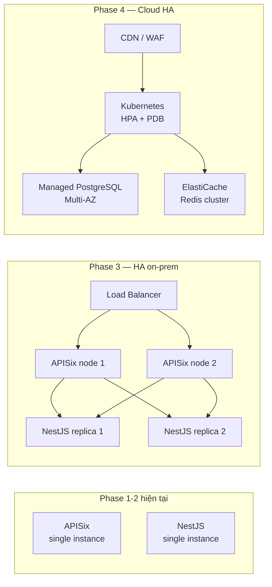

---

### 5.3 🟡 Rủi ro trung bình — Thắt cổ chai tại Gateway

**Mô tả:** Toàn bộ AI request (100 nhân viên × trung bình 5 req/phút = 500 RPM) đều đi qua NestJS. Policy check + Redis lookup + DB fallback thêm latency vào mỗi request.

**Hệ thống đã làm:**

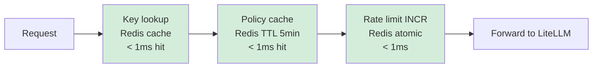

Với caching đúng, overhead của NestJS < **5ms** trên happy path.

| Metric | Target | Giải pháp |
|--------|--------|-----------|
| Key auth | < 1ms | Redis cache (5 min TTL) |
| Policy resolve | < 1ms | Redis cache (5 min TTL) |
| Rate limit check | < 1ms | Redis INCR atomic |
| DB query | < 5ms | Chỉ xảy ra khi cache miss |
| **Total overhead** | **< 10ms** | |
| Gateway latency P99 | < 50ms | APISix benchmark |

**Giải pháp tương lai:**
- Scale NestJS ngang (stateless, không có shared state ngoài Redis/DB)
- Read replica PostgreSQL cho usage queries nặng
- Cache warming khi startup

---

### 5.4 🟡 Rủi ro trung bình — LiteLLM là dependency nặng

**Mô tả:** LiteLLM Proxy là third-party library. Nếu LiteLLM ngừng maintain, thay đổi API breaking, hoặc có security issue, toàn bộ provider routing bị ảnh hưởng.

**Hệ thống đã làm:**
- LiteLLM hoàn toàn tách biệt sau NestJS — interface chỉ là HTTP OpenAI format
- NestJS không gọi LiteLLM SDK trực tiếp — chỉ HTTP POST

**Nếu cần thay thế LiteLLM:**
- Viết adapter riêng cho từng provider (OpenAI SDK, Anthropic SDK)
- Thay đổi chỉ ở `GatewayService` — không ảnh hưởng policy, auth, usage tracking
- Estimated effort: 2–3 sprint

---

### 5.5 🟡 Rủi ro trung bình — Vault là dependency quan trọng

**Mô tả:** Nếu Vault down, NestJS không đọc được provider key mới, và khi token cache hết hạn (1h) sẽ không thể call API provider.

**Hệ thống đã làm:**
- Provider key được cache trong memory của NestJS (không ghi ra disk)
- Vault token TTL 1h — trong 1h đầu Vault có thể down mà không ảnh hưởng

**Giải pháp tương lai:**
- Vault HA mode (3-node Raft cluster)
- Graceful degradation: khi Vault unreachable, dùng cached key thêm 1h trước khi fail

---

### 5.6 🟢 Rủi ro thấp — Prompt/Response logging privacy

**Mô tả:** Nếu log full content của AI conversations, có thể vi phạm privacy của nhân viên và chứa thông tin nhạy cảm (code, business data).

**Hệ thống đã làm:**
- **Metadata-only logging by default**: chỉ log model, token count, cost, latency — không log prompt/response content
- `contentInspection: true` phải được team opt-in rõ ràng trong policy config
- Log được gửi tới AWS CloudWatch với IAM write-only (không thể đọc lại từ app)

---

## 6. Lộ trình cải thiện

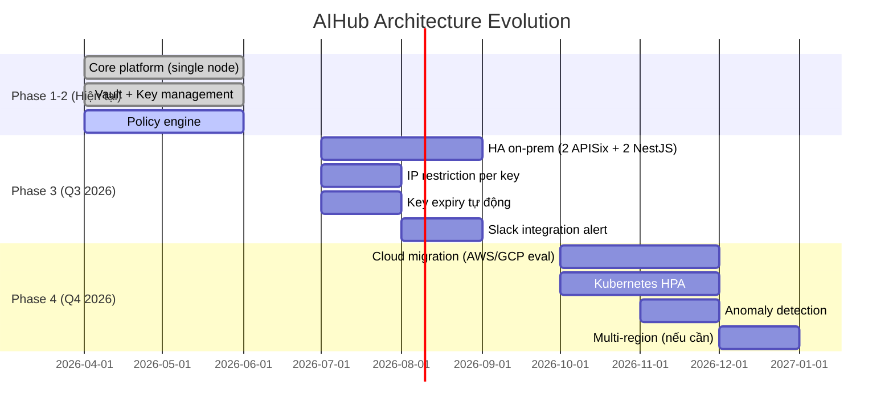

### Tóm tắt roadmap theo rủi ro

| Rủi ro | Phase hiện tại | Phase 3 | Phase 4 |
|--------|---------------|---------|---------|
| Key tập trung bị hack | SHA-256 + Vault | IP restriction, key expiry | HSM, anomaly detection |
| Single point of failure | Health check, restart policy | 2-node HA | K8s multi-AZ |
| Gateway bottleneck | Redis cache < 5ms overhead | NestJS scale ngang | K8s HPA |
| LiteLLM dependency | HTTP interface isolation | Custom adapter option | Multi-adapter |
| Vault downtime | 1h memory cache | Vault HA cluster | Managed secret store |
| Privacy logging | Metadata-only default | Content inspection opt-in | PII detection (optional) |
