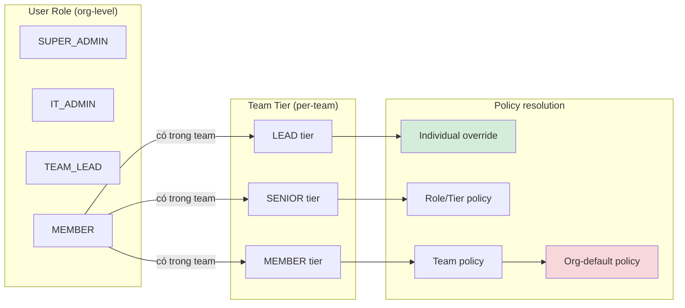
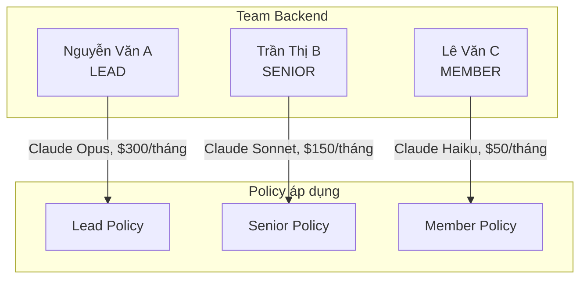

# Roles & Permissions

## Hệ thống phân quyền

AIHub dùng hai lớp phân quyền độc lập:

---

## User Roles

### SUPER_ADMIN
Quyền cao nhất — toàn bộ chức năng của IT_ADMIN cộng thêm khả năng thay đổi cấu hình hệ thống và quản lý các IT_ADMIN khác. Thường là 1–2 người (CTO, Head of IT).

### IT_ADMIN
Quản trị viên hệ thống. Phù hợp với IT team (2–3 người). Có thể:
- Onboard / offboard nhân viên
- Tạo và quản lý team
- Generate, rotate, revoke API key
- Thiết lập policy cho org / team / individual
- Thêm provider key vào Vault
- Xem usage toàn org

### TEAM_LEAD
Tech Lead hoặc Manager của team. Có thể:
- Xem danh sách thành viên team mình
- Xem usage của team và từng member
- Xem policy đang áp dụng
- **Không thể** thay đổi cấu hình, policy, hay key

### MEMBER
Nhân viên thông thường. Chỉ có thể:
- Dùng API key để gọi AI qua Cursor / Claude Code CLI
- Xem trạng thái key của mình

---

## Team Tiers

Mỗi member được gán **tier riêng trong từng team** — một người có thể là LEAD ở team này nhưng MEMBER ở team khác.

---

## Ma trận quyền

| Thao tác | MEMBER | TEAM_LEAD | IT_ADMIN | SUPER_ADMIN |
|----------|:------:|:---------:|:--------:|:-----------:|
| Gọi AI qua gateway | ✓ | ✓ | ✓ | ✓ |
| Xem key của mình | ✓ | ✓ | ✓ | ✓ |
| Xem usage của team | — | ✓ | ✓ | ✓ |
| Xem usage toàn org | — | — | ✓ | ✓ |
| Tạo / offboard user | — | — | ✓ | ✓ |
| Tạo / xóa team | — | — | ✓ | ✓ |
| Thêm / xóa team member | — | — | ✓ | ✓ |
| Generate / rotate / revoke key | — | — | ✓ | ✓ |
| Tạo / cập nhật policy | — | — | ✓ | ✓ |
| Thêm provider key (Vault) | — | — | ✓ | ✓ |
| Giới hạn IP cho key *(planned)* | — | — | ✓ | ✓ |
| Quản lý IT_ADMIN khác | — | — | — | ✓ |
