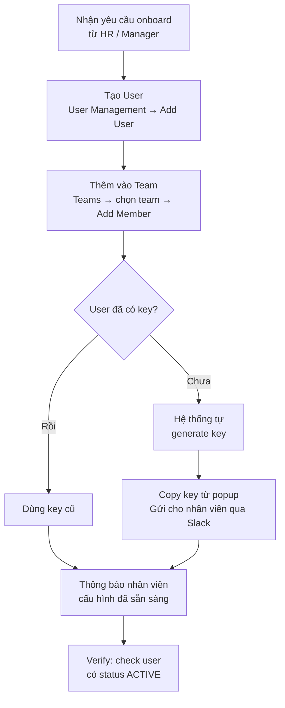
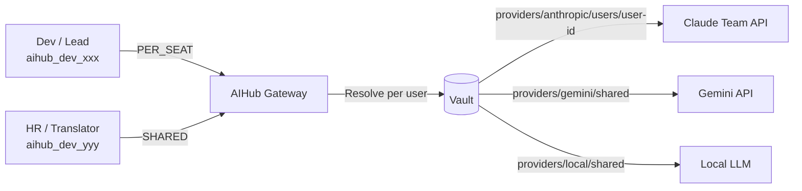
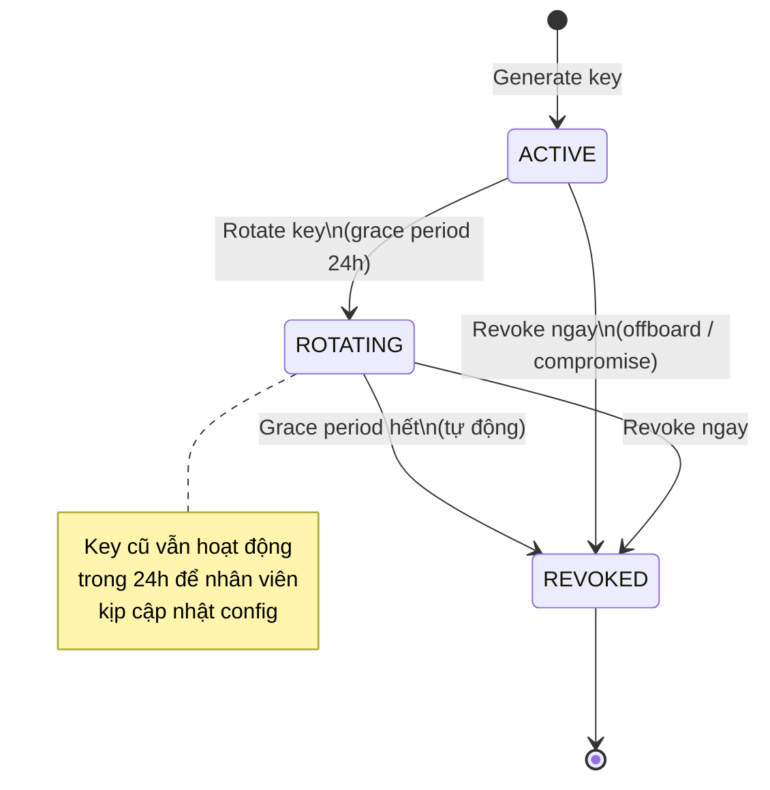
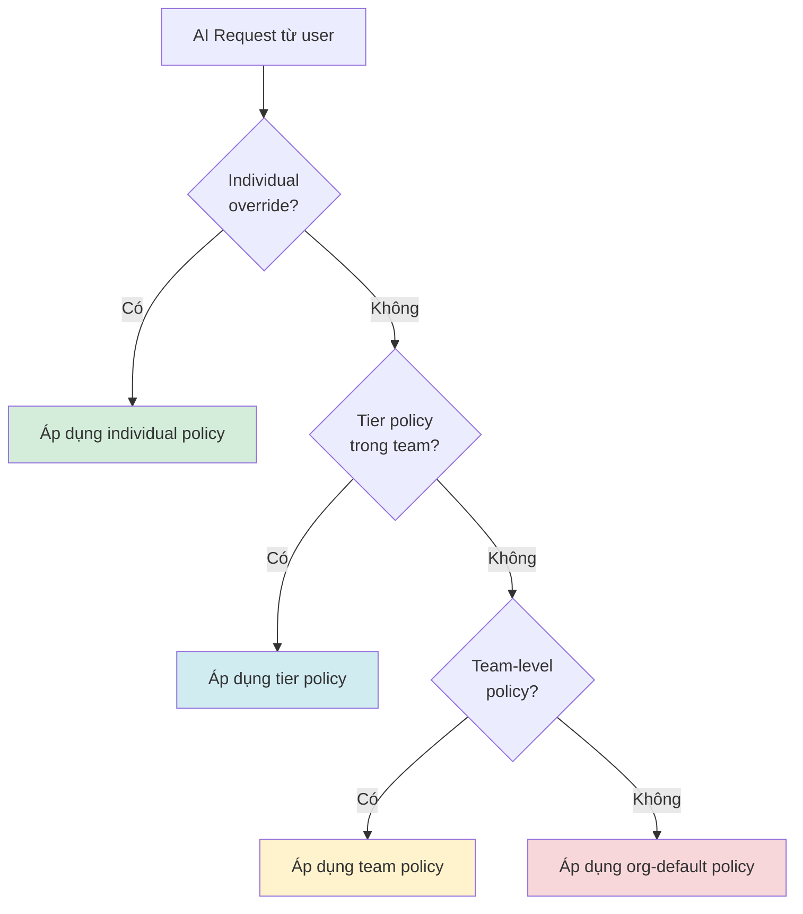
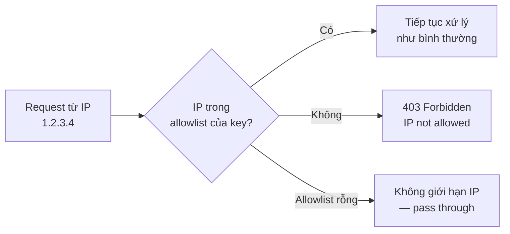

# IT Admin Guide

Dành cho: **IT_ADMIN**, **SUPER_ADMIN**

Đăng nhập Admin Portal bằng tài khoản D-Soft → toàn bộ tính năng quản trị hiển thị trong sidebar trái.

---

## Luồng Onboard nhân viên mới



---

## 1. Quản lý Provider Keys

Provider keys được lưu trong HashiCorp Vault — nhân viên không bao giờ thấy key thật. AIHub hỗ trợ hai chế độ provider key tùy theo loại gói AI:

### Hai loại Provider Key

| Loại | Dùng cho | Cơ chế giới hạn |
|------|----------|-----------------|
| **PER_SEAT** | Claude Team, Codex, ChatGPT Team | Mỗi nhân viên có key riêng — provider enforce giới hạn per-seat (session 5h, quota tuần) |
| **SHARED** | Gemini, Local LLM (Ollama/vLLM) | Dùng chung — AIHub enforce budget + rate limit để tránh 1 người drain pool |

> **Tại sao phân biệt?** Các gói per-seat (Claude Team, Codex) có quota session/tuần gắn với từng seat. Nếu nhiều người dùng chung 1 key, quota cộng dồn → heavy user có thể chặn người khác. Mỗi nhân viên phải có key riêng để quota độc lập.

### Kiến trúc routing



Gateway tự động chọn đúng Provider Key dựa trên user và model được request — nhân viên không cần biết key nào đang được dùng.

---

### 1.1 — Thêm Provider Key dùng chung (SHARED)

Dùng cho: Gemini, Local LLM, bất kỳ provider nào không giới hạn per-seat.

**Lấy API key:**

| Provider | Trang lấy key |
|----------|---------------|
| Google AI (Gemini) | aistudio.google.com → Get API key |
| Local LLM (Ollama) | Không cần key — chỉ cần endpoint URL |

**Trong Admin Portal, vào Settings → Provider Keys → Add Provider:**
1. Chọn provider
2. Chọn **Scope: Shared**
3. Dán API key (hoặc endpoint URL với Local LLM)
4. Click **Save**

---

### 1.2 — Thêm và gán Per-Seat Key (PER_SEAT)

Dùng cho: Claude Team, Codex, ChatGPT Team — mỗi nhân viên 1 seat key riêng.

#### Chuẩn bị (1 lần)

Khi mua gói Team, mỗi seat sẽ cấp 1 API key riêng. Tập hợp các key theo định dạng CSV:

```csv
email,provider,api_key
nguyen.van.a@d-soft.com.vn,anthropic,sk-ant-api03-xxx
tran.thi.b@d-soft.com.vn,anthropic,sk-ant-api03-yyy
le.van.c@d-soft.com.vn,openai,sk-proj-xxx
```

#### Import hàng loạt

Vào **Settings → Provider Keys → Import Per-Seat Keys**:
1. Upload file CSV
2. Hệ thống tự map email → user account → lưu key vào Vault tại path `providers/{provider}/users/{user_id}`
3. Review kết quả — user nào đã được gán hiện badge **Seat Assigned**

#### Gán thủ công cho từng user

Vào **Users → [tên user] → Provider Keys → Assign Seat Key**:
1. Chọn provider
2. Dán API key của seat đó
3. Click **Save**

> **Lưu ý**: Seat key gắn với 1 user. Nếu nhân viên nghỉ việc và bạn offboard họ, key tự bị revoke trong Vault — seat có thể tái gán cho người mới.

---

### 1.3 — Verify trạng thái Provider Keys

Vào **Settings → Provider Keys**:

```
┌─────────────────────────────────────────────────────────────┐
│  Provider Keys                                              │
│                                                             │
│  SHARED KEYS                                                │
│  Gemini           🟢 Connected   Updated: 17/04/2026        │
│  Local LLM        🟢 Connected   Endpoint: 10.0.0.5:11434  │
│                                                             │
│  PER-SEAT KEYS                                              │
│  Anthropic        🟢 45/50 seats assigned                   │
│  OpenAI           🟡 30/30 seats assigned (full)            │
│                                                             │
└─────────────────────────────────────────────────────────────┘
```

| Muốn biết | Xem ở đâu |
|-----------|-----------|
| Team nào tốn bao nhiêu | **Usage → By Team** |
| Provider nào (Anthropic/OpenAI/Gemini) | Filter theo model: `claude-*` = Anthropic, `gpt-*` = OpenAI, `gemini-*` = Google |
| Nhân viên nào chưa có seat key | **Settings → Provider Keys → Anthropic → Unassigned seats** |

> **Nếu cần thêm model mới của cùng provider**: không cần thêm key, chỉ cần cập nhật LiteLLM config (liên hệ DevOps).

---

## 2. Onboard nhân viên mới (User Management)

**Bước 1 — Tạo user**

Vào **Users → Add User**, điền thông tin:
- **Email**: địa chỉ email D-Soft (`@d-soft.com.vn`)
- **Full Name**: Họ và tên đầy đủ
- **Role**: chọn `MEMBER` (mặc định), `TEAM_LEAD`, hoặc `IT_ADMIN`

Click **Create User**.

**Bước 2 — Thêm vào team**

Vào **Teams → [tên team] → Members → Add Member**:
1. Tìm user vừa tạo (search theo email)
2. Chọn **Tier**: `MEMBER`, `SENIOR`, hoặc `LEAD`
3. Click **Add**

Nếu user chưa có API key, hệ thống **tự động generate** một key và hiện popup:

```
┌─────────────────────────────────────────────┐
│  API Key Generated                          │
│                                             │
│  aihub_dev_a1b2c3d4e5f6g7h8i9j0...         │
│                                             │
│  ⚠️  Key này chỉ hiển thị một lần.         │
│      Copy và gửi cho nhân viên ngay.        │
│                                             │
│  [Copy to clipboard]          [Close]       │
└─────────────────────────────────────────────┘
```

**Bước 3 — Gửi key cho nhân viên**

Gửi qua Slack DM (kênh riêng, không dùng channel chung):

```
Chào [Tên],

Bạn đã được cấp quyền truy cập AIHub. API key của bạn:

  aihub_dev_xxxxxxxxxxxxxxxxxxxxxxxxxxxxxxxx

Xem hướng dẫn cấu hình Cursor / Claude CLI tại:
  docs/user-manual/04-member-guide.md

Key này chỉ hiển thị một lần. Nếu mất, liên hệ IT để rotate.
```

---

## 3. Generate API key thủ công (API Key Management)

Dùng khi user đã tồn tại nhưng chưa có key, hoặc cần key bổ sung.

Vào **API Keys → Generate Key**:
1. Tìm user bằng search (email hoặc tên)
2. Click **Generate**
3. Popup hiện key — **copy ngay**, sau đó gửi cho nhân viên

---

## 4. Vòng đời API Key



---

## 5. Rotate API key (API Key Management)

Dùng khi: key bị lộ, nhân viên yêu cầu đổi, policy rotation định kỳ.

**Bước 1** — Vào **API Keys**, tìm key cần rotate (search theo tên user hoặc key prefix).

**Bước 2** — Click biểu tượng **⟳ Rotate** ở cuối hàng của key đó.

**Bước 3** — Xác nhận trong dialog:
```
Rotate key aihub_dev_a1b2... của Nguyễn Văn A?
Key cũ sẽ tiếp tục hoạt động trong 24h (grace period).
[Cancel]  [Confirm Rotate]
```

**Bước 4** — Popup hiện key mới — copy và gửi cho nhân viên ngay.

**Bước 5** — Nhân viên cập nhật key trong Cursor / CLI, key cũ tự revoke sau 24h.

---

## 6. Revoke API key (API Key Management)

Dùng khi: nhân viên nghỉ việc, key bị compromise, cần thu hồi ngay lập tức (không grace period).

**Bước 1** — Vào **API Keys**, tìm key cần revoke.

**Bước 2** — Click biểu tượng **🚫 Revoke** ở cuối hàng.

**Bước 3** — Xác nhận:
```
⚠️  Revoke key aihub_dev_a1b2... của Nguyễn Văn A?
Hành động này có hiệu lực NGAY LẬP TỨC và không thể hoàn tác.
[Cancel]  [Revoke Permanently]
```

> Sau khi revoke, mọi request dùng key này trả về `401 Unauthorized` ngay lập tức.

---

## 7. Thiết lập Policy (Policy Management)

### Policy cascade



### 7.1 — Tạo policy cho toàn org (org-default)

Vào **Policies → Create Policy**:

| Field | Giá trị |
|-------|---------|
| Name | `Org Default` |
| Scope | Để trống (org-wide) |
| Priority | `0` |
| Allowed Models | `claude-haiku-4-5`, `gpt-4o-mini` |
| Rate Limit (RPM) | `20` |
| Daily Tokens | `100,000` |
| Monthly Budget (USD) | `$30` |

Click **Save**.

### 7.2 — Tạo policy cho team

Vào **Policies → Create Policy**:

| Field | Giá trị ví dụ |
|-------|---------------|
| Name | `Backend Team Policy` |
| Scope | Team → chọn "Backend" |
| Tier | Để trống (áp dụng tất cả tier trong team) |
| Priority | `10` |
| Allowed Models | `claude-sonnet-4-6`, `gpt-4o`, `claude-haiku-4-5` |
| Monthly Budget | `$100` |
| Fallback | Bật: khi ≥ 80% budget, downgrade từ `claude-sonnet-4-6` → `claude-haiku-4-5` |

### 7.3 — Tạo policy theo tier

Vào **Policies → Create Policy**, thêm Tier vào Scope:

| Field | LEAD | SENIOR |
|-------|------|--------|
| Tier | `LEAD` | `SENIOR` |
| Allowed Models | *(để trống = tất cả)* | `claude-sonnet-4-6`, `gpt-4o` |
| Monthly Budget | `$300` | `$150` |
| Priority | `20` | `15` |

### 7.4 — Override cá nhân

Vào **Users → [tên user] → Policies → Add Override**:
- Thiết lập riêng cho một người, ghi đè toàn bộ policy bên dưới
- Dùng cho nhân viên có nhu cầu đặc biệt (researcher, architect)

### 7.5 — Kiểm tra policy effective

Vào **Users → [tên user] → Policy Preview**:

```
┌─────────────────────────────────────────┐
│  Effective Policy — Nguyễn Văn A        │
│  Resolved from: team-policy (Backend)   │
│                                         │
│  Allowed models:                        │
│    • claude-sonnet-4-6                  │
│    • gpt-4o                             │
│                                         │
│  Limits:  60 RPM | 300K tokens/day      │
│           $100/month                    │
│                                         │
│  Fallback: Sonnet → Haiku at 80%        │
└─────────────────────────────────────────┘
```

---

## 8. Offboard nhân viên (User Management)

**Bước 1** — Vào **Users**, tìm nhân viên (search email).

**Bước 2** — Click vào tên user → trang User Detail.

**Bước 3** — Click **Offboard User** (màu đỏ, góc trên phải).

**Bước 4** — Xác nhận:
```
⚠️  Offboard Nguyễn Văn A?

Hành động này sẽ:
  • Thu hồi tất cả API keys ngay lập tức
  • Đánh dấu tài khoản là OFFBOARDED
  • Không thể đăng nhập lại

[Cancel]  [Confirm Offboard]
```

Hệ thống tự động revoke toàn bộ key và ghi log audit trail.

---

## 9. Xem Usage (Usage Dashboard)

Vào **Usage** trong sidebar:

- **Tab Org Overview**: tổng cost tháng hiện tại, biểu đồ theo ngày, top 10 user tiêu nhiều nhất
- **Tab By Team**: so sánh usage giữa các team, chọn khoảng thời gian
- **Tab By User**: drill down từng user, xem model nào được dùng nhiều

Bộ lọc thời gian: chọn tháng hoặc khoảng ngày tùy chỉnh.

---

## 10. Giới hạn IP cho API Key *(Planned — Chưa triển khai)*

> **📋 Feature này đang trong kế hoạch phát triển.** Giao diện và luồng dưới đây mô tả hành vi dự kiến.

Giới hạn IP cho phép ràng buộc một API key chỉ hoạt động từ một số địa chỉ IP nhất định — tăng cường bảo mật cho key của các service/server.

### Luồng dự kiến



### Giao diện dự kiến

Tại **API Keys → [key] → IP Restrictions**:

```
┌────────────────────────────────────────────┐
│  IP Restrictions — aihub_dev_a1b2...       │
│                                            │
│  ○ No restriction (default)               │
│  ● Allowlist specific IPs                  │
│                                            │
│  Allowed IPs / CIDR:                       │
│  ┌──────────────────────────────────────┐  │
│  │ 203.0.113.10                         │  │
│  │ 10.0.0.0/8                           │  │
│  └──────────────────────────────────────┘  │
│  [+ Add IP / CIDR]                         │
│                                            │
│  [Cancel]                     [Save]       │
└────────────────────────────────────────────┘
```

### Use cases

| Scenario | IP nên thêm |
|----------|-------------|
| CI/CD pipeline (GitHub Actions) | IP của GitHub Actions runner |
| Service chạy trên server nội bộ | Dải IP nội bộ `10.0.0.0/8` |
| Developer làm việc cố định ở văn phòng | IP tĩnh của văn phòng D-Soft |
| Key dùng cho laptop cá nhân | Không nên bật (IP thay đổi) |

> **Implementation note (for dev team)**: Cần thêm field `allowedIps: string[]` vào model `ApiKey`, validate trong `ApiKeyGuard` bằng cách so sánh `req.ip` với allowlist (hỗ trợ CIDR notation). Xem `api/src/modules/gateway/guards/api-key.guard.ts`.
