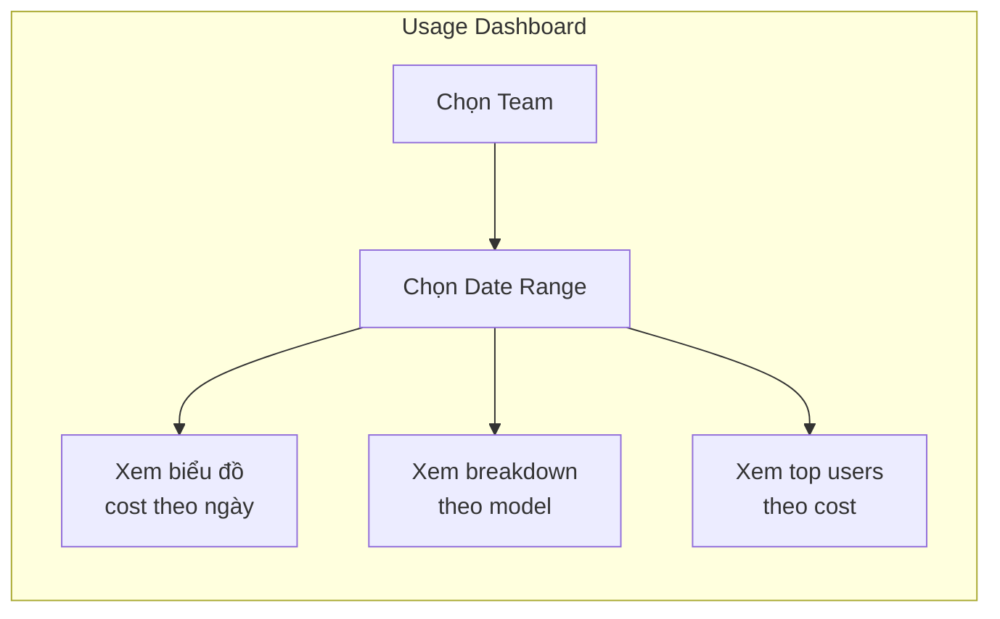

# Team Lead Guide

Dành cho: **TEAM_LEAD**

Team Lead có thể xem thông tin team và theo dõi usage — không thể thay đổi cấu hình hệ thống.

---

## 1. Xem danh sách thành viên

Vào **Teams → [tên team của bạn] → tab Members**:

```
┌─────────────────────────────────────────────────────────────┐
│  Team: Backend                                              │
│  3 members  |  Monthly budget: $250 / $400                  │
├──────────────┬────────────┬──────────┬──────────────────────┤
│  Tên         │  Email     │  Tier    │  Status              │
├──────────────┼────────────┼──────────┼──────────────────────┤
│  Nguyễn A    │  a@d-soft  │  LEAD    │  🟢 Active           │
│  Trần B      │  b@d-soft  │  SENIOR  │  🟢 Active           │
│  Lê C        │  c@d-soft  │  MEMBER  │  🟢 Active           │
└──────────────┴────────────┴──────────┴──────────────────────┘
```

---

## 2. Xem Usage của team

Vào **Usage → By Team → chọn team của bạn**:

- Chọn khoảng thời gian (tháng hiện tại, tháng trước, hoặc custom range)
- Biểu đồ hiển thị cost theo ngày, breakdown theo model
- Bảng bên dưới liệt kê từng member với tổng token và cost



### So sánh hai tháng

1. Mở tab **By Team**, chọn tháng này
2. Click **Compare** → chọn tháng trước
3. Chart hiển thị hai đường song song

---

## 3. Xem usage của một member cụ thể

Vào **Usage → By User → search tên hoặc email member**.

Thông tin hiển thị:
- Tổng tokens đã dùng trong kỳ
- Tổng cost (USD)
- Breakdown theo model (model nào dùng nhiều nhất)
- Timeline theo ngày

Dùng để phát hiện: member nào dùng nhiều bất thường, member nào chưa bắt đầu dùng.

---

## 4. Xem policy đang áp dụng cho team

Vào **Teams → [tên team] → tab Policies**:

- Danh sách policies đang active của team, sắp xếp theo priority
- Click vào policy để xem chi tiết: model allowlist, budget limits, fallback config

### Xem policy effective của một member

Vào **Users → [tên member] → tab Policy Preview**:

```
Effective Policy — Trần Thị B
Resolved from: Senior Tier Policy (Backend)

Allowed models: claude-sonnet-4-6, gpt-4o
Rate limit: 40 RPM
Daily tokens: 300,000
Monthly budget: $150
Fallback: Sonnet → Haiku at 80% budget
```

---

## 5. Yêu cầu thay đổi (qua IT Admin)

Team Lead không thể trực tiếp thay đổi policy hay tier. Liên hệ IT Admin khi cần:

| Tình huống | Yêu cầu IT Admin làm gì |
|-----------|------------------------|
| Member cần dùng model mạnh hơn | Nâng tier lên SENIOR hoặc tạo individual override |
| Member sắp hết budget | Tăng `monthlyBudgetUsd` trong policy |
| Cần thêm model mới vào allowlist | Cập nhật `allowedEngines` trong team policy |
| Member mới gia nhập team | Onboard và add member vào team |
| Member chuyển sang team khác | Remove khỏi team cũ, add vào team mới |

Khi liên hệ IT Admin, cung cấp:
- Tên và email member
- Lý do cần thay đổi
- Model / budget cụ thể cần thêm
