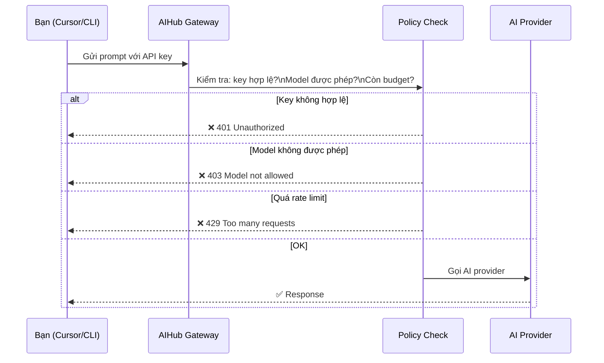

# Member Guide — Hướng dẫn cho nhân viên

Dành cho: **Tất cả nhân viên D-Soft** sử dụng AI tools

---

## 1. Nhận API key

Khi được onboard, IT Admin sẽ gửi API key cho bạn qua **Slack DM**:

```
aihub_dev_a1b2c3d4e5f6g7h8i9j0k1l2m3n4o5p6
```

> **Quan trọng**: Key chỉ hiển thị **một lần duy nhất**. Lưu ngay vào password manager (1Password, Bitwarden). Nếu mất, nhắn tin IT Admin (`#it-support`) để được cấp key mới.

---

## 2. Cấu hình Cursor

Cursor là IDE AI phổ biến nhất tại D-Soft. Thực hiện theo các bước sau:

> **Tại sao không dùng Anthropic/OpenAI key trực tiếp?** AIHub là trung gian — bạn dùng Member API Key của mình, AIHub xác thực và forward request đến đúng provider bằng org credentials. Lợi ích: IT Admin kiểm soát được budget, model access và usage của toàn công ty tập trung.

**Bước 1** — Mở Cursor, vào **File → Preferences → Cursor Settings** (hoặc `Cmd/Ctrl + Shift + J`).

**Bước 2** — Vào tab **Models**.

**Bước 3** — Tìm mục **OpenAI API Key** (hoặc **Custom API**), điền:

| Field | Giá trị |
|-------|---------|
| **API Base URL** | `https://aihub.d-soft.com.vn/v1` |
| **API Key** | API key của bạn (`aihub_dev_xxxx...`) |

**Bước 4** — Click **Verify** — nếu hiện ✓ Connected là thành công.

**Bước 5** — Chọn model mặc định theo tier của bạn (hỏi Team Lead nếu không chắc):

| Tier | Model nên dùng mặc định |
|------|------------------------|
| MEMBER | `claude-haiku-4-5-20251001` |
| SENIOR | `claude-sonnet-4-6` |
| LEAD | `claude-sonnet-4-6` hoặc `claude-opus-4-7` |

---

## 3. Cấu hình Claude Code CLI

Claude Code là CLI tool phát triển bởi Anthropic, được D-Soft hỗ trợ chính thức.

**Bước 1** — Cài đặt (nếu chưa có):
```bash
npm install -g @anthropic-ai/claude-code
```

**Bước 2** — Thiết lập environment variables. Thêm vào `~/.zshrc` (macOS) hoặc `~/.bashrc` (Linux):
```bash
export ANTHROPIC_BASE_URL="https://aihub.d-soft.com.vn/v1"
export ANTHROPIC_API_KEY="aihub_dev_xxxx..."
```

**Bước 3** — Apply config:
```bash
source ~/.zshrc
```

**Bước 4** — Kiểm tra kết nối:
```bash
claude --version
claude "Xin chào, đây là test connection"
```

---

## 4. Luồng một AI request qua AIHub



---

## 5. Kiểm tra trạng thái key của mình

Đăng nhập **Admin Portal** (bằng tài khoản D-Soft) → vào **My Profile → API Key**:

```
┌─────────────────────────────────────────┐
│  My API Key                             │
│                                         │
│  Prefix:      aihub_dev_a1b2            │
│  Status:      🟢 Active                 │
│  Created:     17/04/2026                │
│  Last used:   18/04/2026 08:32          │
└─────────────────────────────────────────┘
```

`Status: Active` = key đang hoạt động bình thường.

---

## 6. Model nào tôi được dùng?

Phụ thuộc vào **tier** của bạn trong team — do IT Admin thiết lập. Hỏi Team Lead để biết tier của mình.

Nếu dùng model không được phép, gateway sẽ:
- Tự động downgrade sang model rẻ hơn (nếu team có cấu hình fallback)
- Hoặc trả về lỗi `403 Model not allowed`

---

## 7. Xử lý lỗi thường gặp

| Lỗi | Nguyên nhân | Bạn cần làm |
|-----|-------------|-------------|
| `401 Unauthorized` | Key sai hoặc đã bị revoke | Kiểm tra lại key trong Cursor/CLI, hoặc nhắn IT Admin |
| `403 Model not allowed` | Model chưa được cấp quyền | Dùng model thấp hơn, hoặc nhờ Team Lead liên hệ IT Admin |
| `429 Rate Limit Exceeded` | Gửi quá nhiều request/phút | Chờ 1 phút rồi thử lại |
| `402 Budget Exceeded` | Hết monthly budget | Nhắn Team Lead để IT Admin tăng budget |
| Request tự động dùng model khác | Fallback được kích hoạt (gần hết budget) | Bình thường — tháng sau reset |
| `503 Service Unavailable` | Gateway hoặc provider đang lỗi | Chờ và thử lại; báo `#it-support` nếu kéo dài > 5 phút |

---

## 8. Key bị lộ / mất

Nhắn **IT Admin ngay lập tức** qua Slack `#it-support`:

```
@it-admin API key của mình bị lộ, cần revoke gấp.
Account: nguyen.van.a@d-soft.com.vn
```

IT Admin sẽ revoke key cũ (hiệu lực ngay) và cấp key mới trong vài phút.
