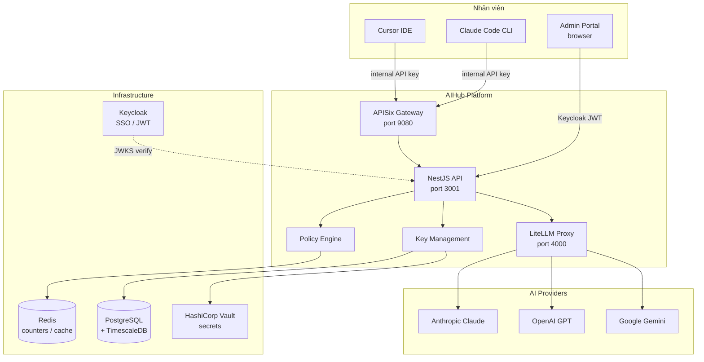
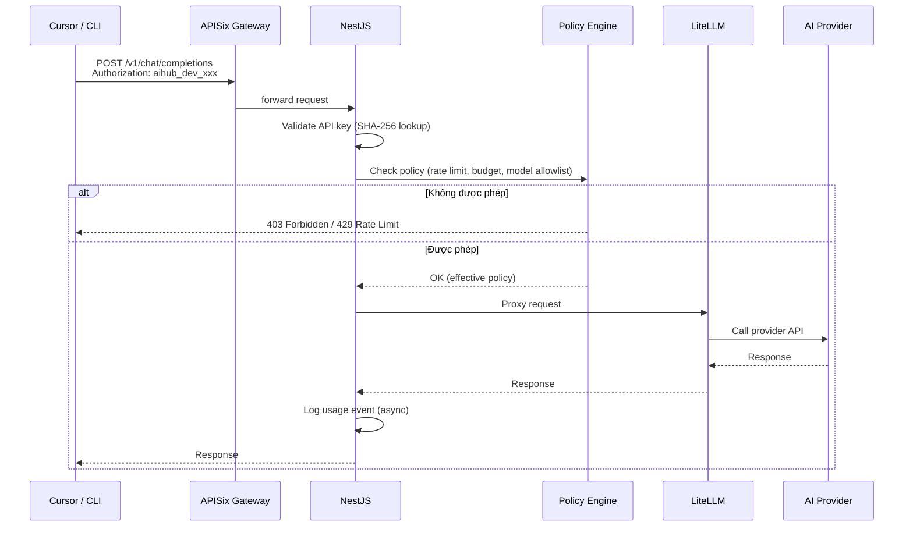

# AIHub — Hướng dẫn sử dụng

AIHub là nền tảng quản lý tập trung tài nguyên AI (Claude, OpenAI, Gemini) cho toàn bộ nhân viên D-Soft. Mọi request AI đều đi qua AIHub — nhân viên không cần giữ provider API key riêng.

## Mục lục

| Tài liệu | Đối tượng |
|----------|-----------|
| [01 — Roles & Permissions](./01-roles-and-permissions.md) | Tất cả |
| [02 — IT Admin Guide](./02-it-admin-guide.md) | IT Admin, Super Admin |
| [03 — Team Lead Guide](./03-team-lead-guide.md) | Team Lead |
| [04 — Member Guide](./04-member-guide.md) | Nhân viên |

---

## Kiến trúc hệ thống

---

## Luồng xử lý một AI request

---

## Truy cập Admin Portal

| Môi trường | URL |
|------------|-----|
| Production | `https://aihub.d-soft.com.vn` |
| Staging | `https://aihub-staging.d-soft.com.vn` |
| Dev (local) | `http://localhost:5173` |

Đăng nhập bằng **tài khoản D-Soft** (Google Workspace / LDAP qua Keycloak).
